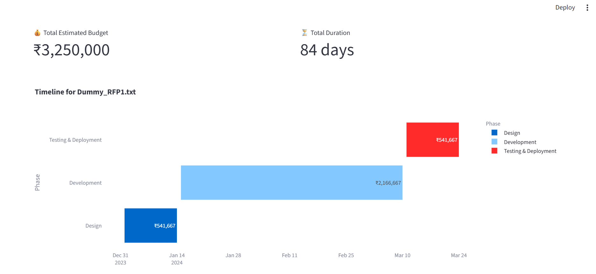
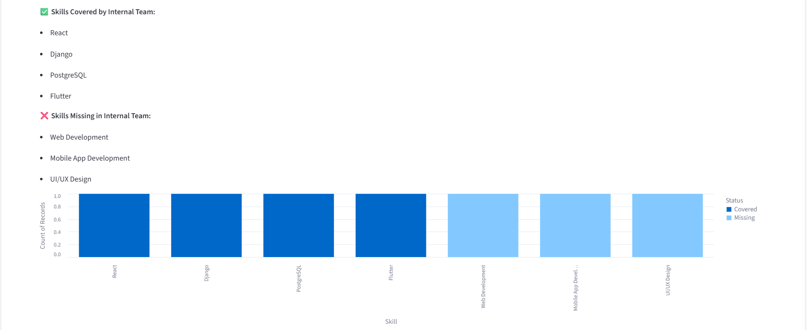
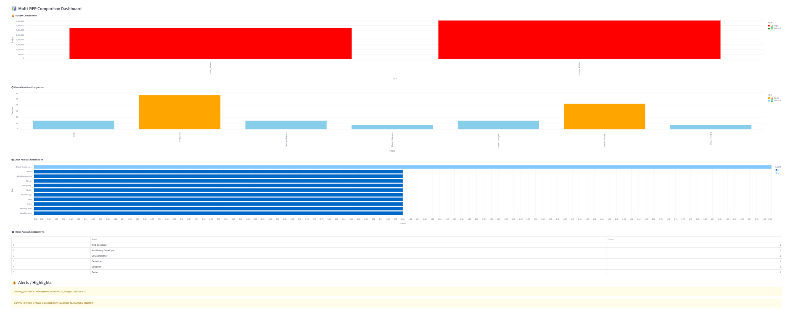

# 📄 PlanGenie – RFP Analyzer & Multi-RFP Comparator

**PlanGenie** is an AI-powered tool for analyzing and comparing multiple Request for Proposals (RFPs). It extracts key project insights, visualizes timelines, budgets, skill requirements, and identifies skill gaps against internal team capabilities. Ideal for decision support in project management.

---

## 🚀 Features

### **RFP Analysis**
- Extract project title, scope, deliverables, required skills, timeline, and cost estimates from any RFP.
- AI-powered question-answering system using **RAG + LLM** for insights.

### **Timeline & Budget Visualization**
- Gantt chart visualization for project phases.
- KPI cards: Total Budget, Total Duration.
- Detailed budget allocation table.

### **Roles & Tasks**
- Lists all roles and corresponding tasks extracted from RFPs.

### **Skill Gap Analysis**
- Compares required skills in RFPs with internal team skills.
- Highlights **✅ Covered** vs **❌ Missing** skills.
- Interactive bar chart for visualizing skill gaps.

### **Multi-RFP Comparison**
- Compare multiple RFPs side-by-side.
- Metrics: Total Budget, Average Duration, Total Roles, Total Skills.
- Charts for skills and roles overlap across RFPs.
- Executive summary dashboard for decision-making.

### **Export Options**
- Export analysis results as **JSON**, **PDF**, or **Excel** for reporting.

---

## 🖥 Screenshots

### Timeline & Budget Gantt Chart


### Skill Gap Analysis


### Multi-RFP Comparison Dashboard


---

## ⚙️ Installation

### 1. Clone the repository:

```bash
git clone https://github.com/yourusername/PlanGenie-RFP-Analyzer.git
cd PlanGenie-RFP-Analyzer
```
### 2. Create a virtual environment:
```bash
python -m venv venv
source venv/bin/activate  # Linux/macOS
venv\Scripts\activate     # Windows
```
### 3. Install dependencies:
```bash
pip install -r requirements.txt
```
## 🏃‍♂️ Usage
### Run the Streamlit app:
```bash
streamlit run Streamlit/streamlit_app.py
```
• Upload one or multiple RFP .txt files.

• Navigate tabs: Overview → Timeline → Roles → Ask Questions →   Compare RFPs → Skill Gap Analysis.

• Export analysis using the export section.

## Project Structure
```bash
PlanGenie/
├─ data/                # RFP files (raw & processed)
├─ analysis/            # RFP analyzer logic
├─ rag/                 # RAG & LLM modules
├─ Streamlit/           # Streamlit app & dashboards
├─ utils/               # Helper utilities (export, skills, file reading)
├─ requirements.txt     # Python dependencies
├─ README.md
```